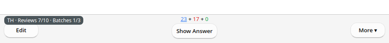
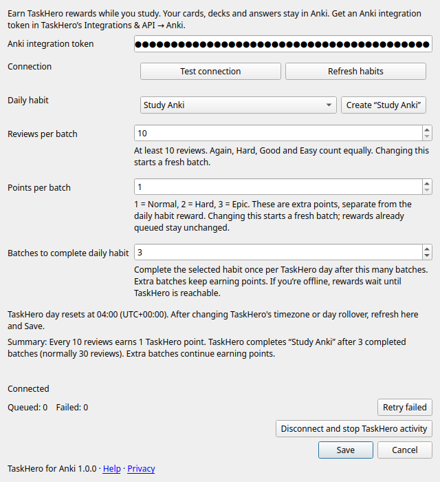

# TaskHero for Anki

Earn [TaskHero](https://taskhero.app) points and complete your daily study habit
while reviewing in Anki.

For Anki **26.8.1 or later** on **Windows, macOS, and Linux**.
Requires a TaskHero account.

## How rewards work

With the default settings, every **10 reviews earns 1 TaskHero point**. Finish
**3 batches (30 reviews)** to complete your linked daily habit too. You can keep
earning points after reaching your daily goal.

Choose a batch size of at least 10 reviews, earn 1–3 points per batch, and set
your own daily batch goal. Again, Hard, Good, and Easy all count equally.

## Get started

Sync your collection before connecting so existing mobile reviews are included
in your starting history.

1. Download `taskhero-for-anki.ankiaddon` from
   [GitHub Releases](https://github.com/whetware/TaskHero-Anki/releases).
2. In Anki, open **Tools → Add-ons → Install from file…**, select the download,
   and restart Anki.
3. In TaskHero, open **Integrations & API → Anki**, generate an Anki token, and
   copy it.
4. In Anki, open **Tools → TaskHero for Anki → Settings…**, paste the token,
   and click **Test connection**.
5. Click **Create “Study Anki”**, or **Refresh habits** to select an existing
   habit that repeats every day with one repetition.
6. Choose your reward settings and click **Save**. You're ready to study.

## Studying on your phone

Reviews in AnkiMobile and AnkiDroid earn rewards after you sync them to Anki
on your computer with the add-on connected. The add-on itself runs on your
computer, not your phone.

Use **one connected computer per synced collection** to avoid duplicate rewards.
Mobile reviews not yet on your computer can count when they arrive in a later
sync, even if you studied before connecting or while disconnected.

## A few things to know

- **Start fresh:** existing reviews on your computer aren't rewarded when you
  first connect.
- **Daily reset:** progress follows your TaskHero day, and unfinished batches
  don't carry over. If you change your timezone or day rollover in TaskHero,
  click **Refresh habits**, then **Save** in the add-on settings.
- **Undo:** undoing a review within 10 seconds prevents its reward. Redo doesn't
  restore that credit, and rewards already sent can't be reversed from Anki.

See the [known limitations](docs/release-notes-1.0.0.md#known-limitations).

## Disconnect or uninstall

Before changing accounts or replacing your Anki token, choose **Disconnect**
in the add-on settings. This removes the saved token, cancels unsent rewards,
and resets your batch and daily-goal progress. Reviews already present on your
computer when you reconnect won't count. Sync before reconnecting to include
your mobile history in that exclusion.

To uninstall, disconnect first, then remove the add-on through **Tools → Add-ons**.
This won't remove rewards you've already received in TaskHero.

## Privacy

Your cards, answers, and deck names stay in Anki. No ads or analytics.
See the [privacy policy](PRIVACY.md) for details and local data-removal instructions.

## Need help?

If rewards aren't arriving, open the add-on settings and check your connection.
After fixing a connection or habit-selection problem, click **Retry failed**.
If the saved token is unavailable, the add-on may require **Disconnect** before
reconnecting, so another account cannot receive your old queued rewards.

Email [support@taskheroics.com](mailto:support@taskheroics.com) for help.
Report security concerns [privately](SECURITY.md).

## License

Copyright © 2026 Whetware, Inc. Licensed under [AGPL-3.0-or-later](LICENSE).
An independent add-on, not affiliated with or endorsed by Anki or Ankitects.

Want to contribute? See [CONTRIBUTING.md](CONTRIBUTING.md).
